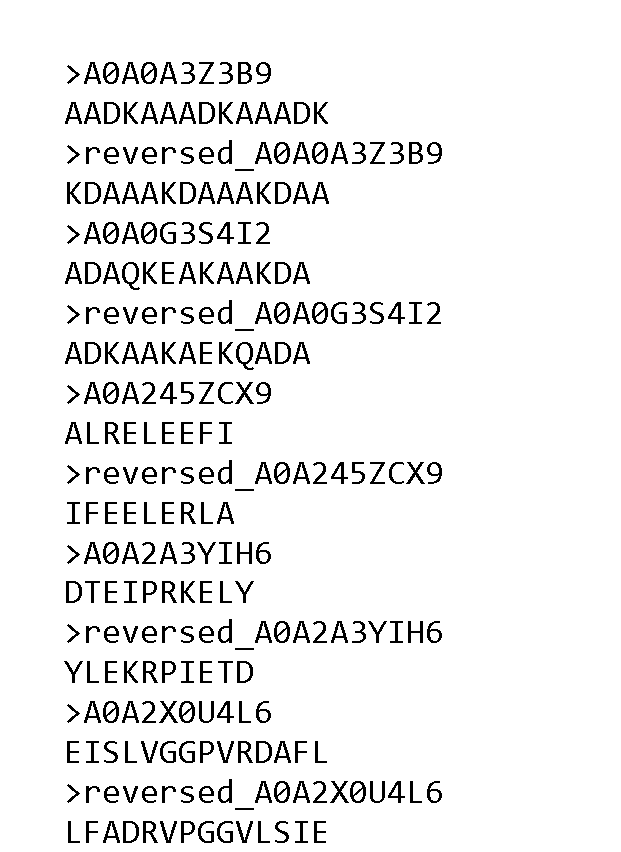
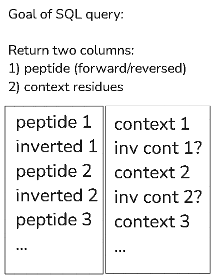

# Integrating context and inverted peptide binders within Galaxy
- Created: April 1, 2025
- Updated: April 2, 2025

## Project overview
* **Project:** meta-immunopeptidomics - Galaxy-based bioinformatics workflow that detects, verifies, and characterizes HLA-bound microbial peptides from human tumor samples
* **Lab Head:** Dr. Timothy J. Griffin
* **Mentors:** Dr. Timothy J. Griffin, Dr. Pratik D. Jagtap
* **Bioinformatics Researcher:** Subina Mehta
* **Galaxy Application Developer:** Reid Wagner

## Questions remaining: (4/1/25 - asked NetMHC dev, waiting for reply)
- Confirm if peptide inversion is simply reversing the sequence
- How context is assessed by NetMHCiipan (one input, or binding core + diff residues?)
- Are context residues included in peptide inversion, ie., are they also inverted?

## Objectives of this document:
* Documenting ideas for integrating peptide context encoding and prediction of inverted peptide binders within Galaxy
* Practice for using Markdown language and GitHub

## Tools/Services:
* IEDB-API: http://tools.iedb.org/main/tools-api/
* Galaxy tools:
   - NetMHCIIpan tool: in development on MSI instance
   - UniProt: API service
   - Query Tabular
 
## Required User Inputs:
* MHC molecules/HLA alleles
  - Two options: 1) select from dropdown menu, 2) use tabular file from history.
* Peptides of interest
  - Three options: FASTA (from history), tabular (from history), manually entered
  - Here, we are looking at microbial peptides, verified by PepQuery2
* Accession numbers of source proteins
  - Here, we have accession numbers from the FragPipe peptide report (Module 2 Peptide Identification).
 
## NetMHCIIpan website interface and functionality

This is what the [NetMHCIIpan website looks like](https://services.healthtech.dtu.dk/services/NetMHCIIpan-4.3/).

Here is the website interface broken down into the components that we are most interested in:

As seen in the graphic above, here are the main features/parameters:
* Input peptides as `FASTA` or `tabular`
* Molecule selection by a dropdown menu or manual typing
     - Default: `DRB1_0101`
* Specify peptide length(s)
     - Default: `15`
* Threshold cut-offs for %Rank values
     - Default values for strong, weak binders: `1` `5`
* Encode peptide context
     - Consists of 12 context residues/amino acids: 3 upstream of the N-terminus, 3 from the N-terminus, 3 from the C-terminus, and 3 downstream from the ligand
     - Default: `No`
* Predict binding for inverted peptides to all molecules
     - Default: `Peptide inversion only predicted for HLA-DP molecules`
* Include binding affinity (BA) predictions
     - Default: `only eluted ligand (EL) likelihood`

## Current state of the Galaxy tool implementation

Here is the current MSI tool interface:

First, let's cover the features that the Galaxy tool **does** comprise, as shown in the graphic below:

* **A**: Prediction method
   - The method `netmhciipan_el` will be used to obtain ligand predictions.
   - Eluted ligand-based binding predictions are considered to be more biologically relevant than affinity-based predictions (thanks Subina and Flavia).
   - If desired, Galaxy users can use the `netmhciipan_ba` to return binding affinity predictions.
* **B**: MHC/HLA molecule selection
   - Thanks to Reid: Lists of molecules/alleles have been added to NetMHCIIpan, which will allow users to select alleles from a dropdown menu. Alternatively, users can elect to upload a tabular file of alleles (in IEDB format).
* **C**: Peptide length(s)
  -   Peptides that bind to MHC class II molecules tend to be longer than those that bind MHC class II molecules, ranging from 12 to 20 amino acids in length.
  -   Unlike the MHC class I binding groove, the MHC class II binding groove is open at both ends, which allows longer peptides to interact and be loaded onto the MHC class II molecule.
* **D**: Input peptide sequences
  - Users can add their peptides via FASTA or tabular files, or manually entering them.
  - Here, we will use verified microbial peptides (and possibly accession numbers). 

## Bridging the gap between NetMHCIIpan web and IEDB using Galaxy

Reid has been able to create the NetMHCIIpan "base" version via the IEDB-API service, meaning that the current iteration of the Galaxy tool has the same functionality as the API. However, as confirmed by Flavia by email, IEDB is limited in its functionality compared to the NetMHCIIpan website because IEDB **does not** include the options for setting %Rank thresholds, encoding peptide context, or prediction of inverted peptide binders.

(Note: Flavia compared the NetMHCIIpan website compared to the IEDB website, but the IEDB website services are accessible from Galaxy via the IEDB-API. Therefore, it should mean that the IEDB website and API perform the same.)

As mentioned previously, the IEDB-API does not include thresholds, context, and inversion. So here are some mockups of what this could look like in Galaxy:

## Remaining Questions/To-Dos

## %Rank thresholds
Reid shared that this should be a quick implementation. We should use the same defaults as the website for consistency:
* Threshold for strong binders: `1.0`
     - Explanation: percentile rank (%Rank) less than or equal to this cut-off (here, 1.0%) indicates **strong** binding between peptide:HLA class II molecule.
     - Numerically: %Rank_EL =< 1.0
* Threshold for weak binders: `5.0`
     - Explanation: %Rank greater than strong threshold and less than (or equal to) weak threshold indicates **weak** binding between peptide:HLA class II molecule
     - Numerically: 1.0 < %Rank_El =< 5.0

### Peptide inversion
Katherine has been testing out the DecoyDatabase tool for creating inverted peptide sequences--It seems to work well (assuming that the Web tool is just reversing the input sequences).
     - [EU history link](https://usegalaxy.eu/u/katherine.d21/h/eu-03302025-meta-ipep-wf5-test-context-inversion)
*Edit 4/4/25 Via email, MN confirmed that "When enabled, [this takes] an input peptide (such as ABCDEFGHI) and predict binding for its inverted sequence (IHGFEDCBA)"*

### Peptide Context
Testing how to extract the peptide context in Galaxy has been more complicated. Katherine is thinking of using UniProt to generate the (source) protein sequences for the peptides (using accession numbers from FragPipe peptide report) and Query Tabular, which should return the peptide sequence and corresponding context residues.

There's also another separate but related issue of how exactly does NetMHCIIpan evaluate sequences if/when *both* context and inversion are enabled--This would impact how Katherine builds the workflow and how Reid would configure the Galaxy tool wrapper.

*Edit 4/4/25 Via email, MN confirmed that "The context in NOT inverted. This since the context is supposed to caption processing signals, and the [inversion] is related to the MHC binding"*
* ~~Situation 1: Context residues **are** included in inversion > Encoding context must occur *before* peptide inversion, followed by binding prediction.~~
* Situation 2: Context residues are **not** included in inversion ~~> Encoding context must occur *after* peptide inversion, followed by binding prediction.~~
