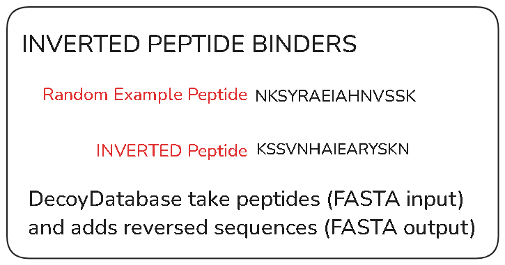

# Integrating context and inverted peptide binders within Galaxy
- Created: April 1, 2025
- Updated: April 1, 2025

## Project overview
* **Project:** meta-immunopeptidomics - Galaxy-based bioinformatics workflow that detects, verifies, and characterizes HLA-bound microbial peptides from human tumor samples
* **Lab Head:** Dr. Timothy J. Griffin
* **Mentors:** Dr. Timothy J. Griffin, Dr. Pratik D. Jagtap
* **Bioinformatics Researcher:** Subina Mehta
* **Galaxy Application Developer:** Reid Wagner

## Objectives of this document:
* Documenting ideas for integrating peptide context encoding and prediction of inverted peptide binders within Galaxy
* Practice for using Markdown language and GitHub

## Tools/Services:
* IEDB-API: http://tools.iedb.org/main/tools-api/
* Galaxy tools:
   - NetMHCIIpan tool: in development on MSI instance
   - UniProt: API service
   - Query Tabular
 
## Required User Inputs:
* MHC molecules/HLA alleles
  - Two options: 1) select from dropdown menu, 2) use tabular file from history.)
* Peptides of interest
  - Three options: FASTA (from history), tabular (from history), manually entered
  - Here, we are looking at microbial peptides
 
## NetMHCIIpan website interface and functionality

This is what the [NetMHCIIpan website looks like](https://services.healthtech.dtu.dk/services/NetMHCIIpan-4.3/).

Here is the website interface broken down into the components that we are most interested in:

As seen in the graphic above, here are the main features/parameters:
* Input peptides as `FASTA` or `tabular`
* Molecule selection by a dropdown menu or manual typing
     - Default: `DRB1_0101`
* Specify peptide length(s)
     - Default: `15`
* Threshold cute-offs for %Rank values
     - Default values for strong, weak binders: `1` `5`
* Encode peptide context
     - Consists of 12 context residues/amino acids: 3 upstream of the N-terminus, 3 from the N-terminus, 3 from the C-terminus, and 3 downstream from the ligand
     - Default: `No`
* Predict binding for inverted peptides to all molecules
     - Default: `Peptide inversion only predicted for HLA-DP molecules`
* Include binding affinity (BA) predictions
     - Default: `only eluted ligand (EL) likelihood`

## Current state of the Galaxy tool implementation

Here is the current MSI tool interface:

Reid has been able to create the NetMHCIIpan "base" version via the IEDB-API service, meaning that the current iteration of the Galaxy tool has the same functionality as the API. However, the IEDB-API is limited in its functionality, compared to the NetMHCIIpan website as it **does not** include the options for encoding peptide context and prediction of inverted peptide binders.

But first, let's cover the features that the Galaxy tool **does** comprise, as shown in the graphic below:
* **A**: Prediction method
   - The method `netmhciipan_el` will be used to obtain ligand predictions.
   - Eluted ligand-based binding predictions are considered to be more biologically relevant than affinity-based predictions (thanks Subina and Flavia).
   - If desired, Galaxy users can use the `netmhciipan_ba` to return binding affinity predictions.
* **B**: MHC/HLA molecule selection
   - Thanks to Reid: Lists of molecules/alleles have been added to NetMHCIIpan, which will allow users to select alleles from a dropdown menu. Alternatively, users can elect to upload a tabular file of alleles (in IEDB format).
* **C**: Peptide length(s)
  -   Peptides that bind to MHC class II molecules tend to be longer than those that bind MHC class II molecules, ranging from 12 to 20 amino acids in length.
  -   Unlike the MHC class I binding groove, the MHC class II binding groove is open at both ends, which allows longer peptides to interact and be loaded onto the MHC class II molecule.
* **D**: Input peptide sequences
  - Users can add their peptides via FASTA or tabular files, or manually entering them.
  - Here, we will use verified microbial peptides (and possibly accession numbers). 

## Brainstorming for integrating context and inversion

As mentioned previously, the IEDB-API does not include context and inversion. So here are some mockups of what this could look like in Galaxy:

